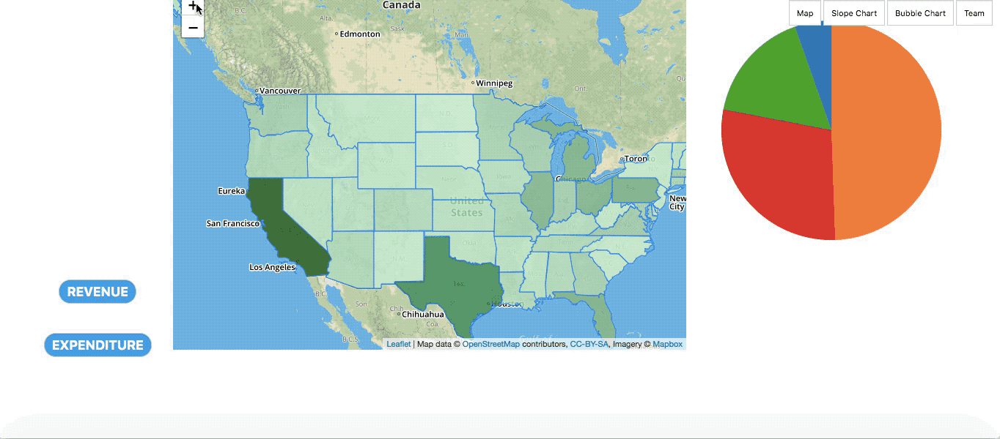
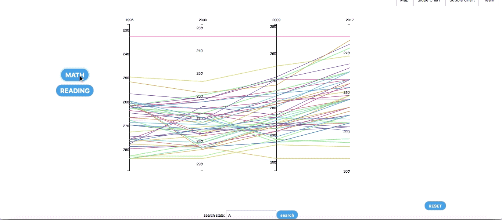
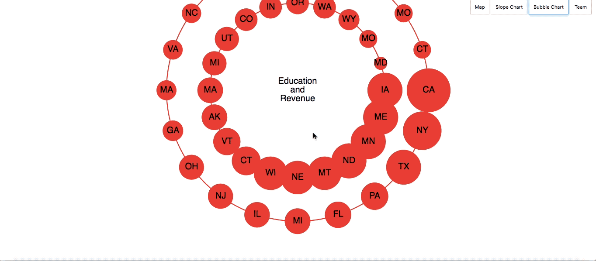

CS573 grad final
---
Link: https://ianhuang96.github.io/gradfinal/index.html

Data: https://www.kaggle.com/noriuk/us-education-datasets-unification-project

Description
---
We made several kinds of charts in including map, pie chart, slope chart and bubble chart in order to find ou relationship between education and economy in US.

Technical achievement
---
- The interactive maps can be zoomed in to show detailed information. 
- Multiple slope chart has a search box which can help us find a specific state easily.
- Two layers of bubble charts which compare the rank directly.
- More buttons provide more action options。

Design achievement
---
- Use eduaction related background on the fisrt page in order to emphasize our theme.
- In slope chart, all the lines have different colors which can distinguish every state.
