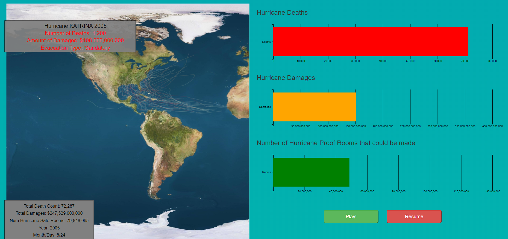

cs573 grad final
---

- Jason Abel
- Github Repo: https://github.com/jabel3141/gradfinal
- gh-pages site: https://jabel3141.github.io/gradfinal/

## Data

The data I used for this project was obtained from International Best Track Archive for Climate Stewardship and Weather Undergroud 

# Description

Natural disasters have always been a big problem for people all across the world. Natural disasters cause many deaths as well as a lot of damages to the areas that they effect. When considering hurricanes, Hurricane Katrina 2005 was one of the worst hurricanes that the Atlantic has seen with more than 1000 deaths and 108 billion in damages. There have been many hurricanes other than Hurricane Katrina with large amounts of deaths and damages which is an issue that is constantly being faced. This brings in the question of why are there so many deaths and damages? Is it that people are not warned well enough to evacuate? Are people not prepared enough for hurricanes? In a particular study, it was determined that the hurricane cone of uncertainty may not be the best way to show hurricane predicted trajectory paths. In the experiment many people confused the cone with area of effect and thought the line was the definite path of the hurricane. Due to this misunderstanding, many people often misinterpret hurricanes and even underestimate the amount of impact it will have a couple days in advance. This visualization will hopefully get viewers to understand the dangers of hurricanes and to hopefully prepare for hurricanes well in advance and listen to evacuation alerts. This project uses an animation in order to help get these views across to the viewers.

A full analysis of this project can be found in the finalPaper folder.

## Technical Achievements
- Mapped latitude and longitude to D3 screen space to plot on the map
- Create multiple views for each hurricane
- Used D3 brush in order to filter area on the map
- Animation used to show hurricane path over time
- Animation slows down and speeds up at different points in the animation
- Animated bar charts to go with the animation
- Play/Pause functionality

## Design Achievements
- Used bootstrap to help format the webpage
- Used nice looking color schemes
- Manually gathered data on deaths, damages and evacuation types for all the hurricanes provided
- Use of animation to tell a story
- Used outside tools in order to create the data set used in the javascript code
- organization of code through different files