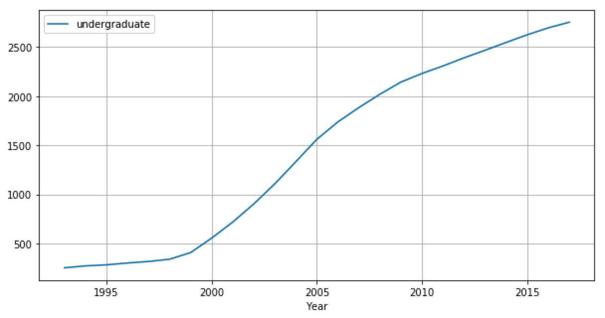
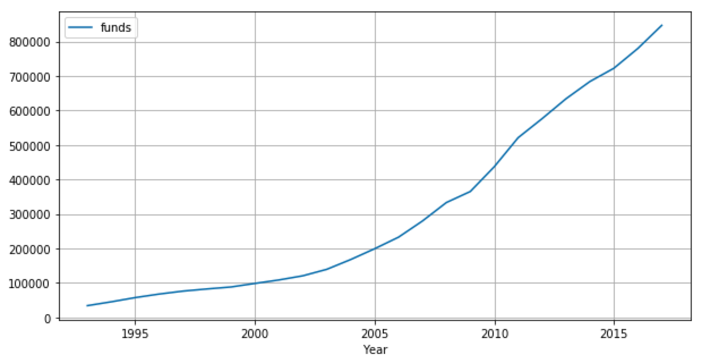
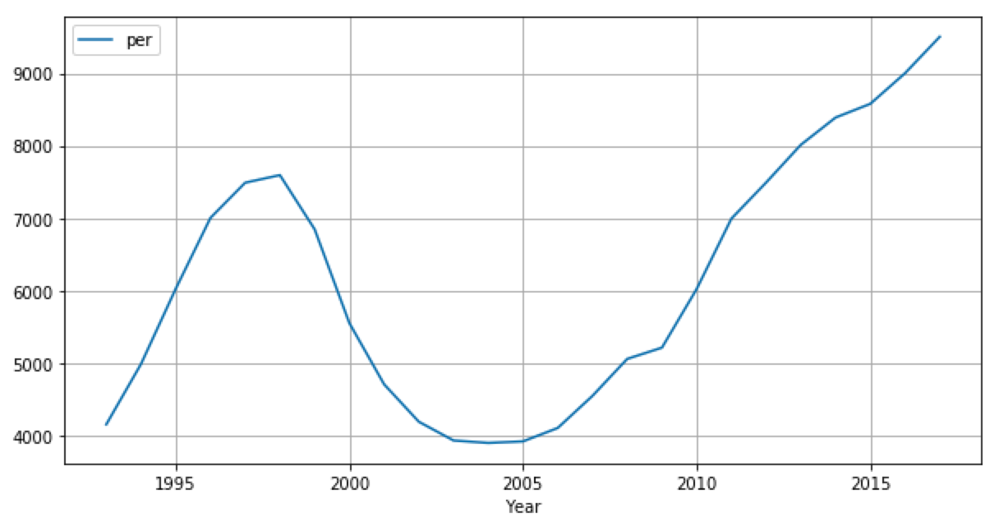
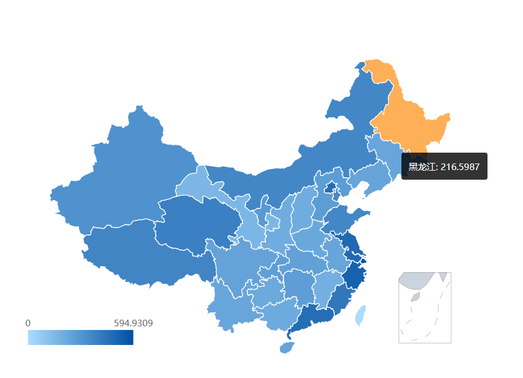

cs573 grad final
===
Topic: 
===
Education funding and undergraduates in different provinces in China

Data:
---
Our data is from National Bureau of Statistics of China(http://data.stats.gov.cn/).

Link:
---

Description:
---

Educational access remains uneven in China. Students born into affluent families generally have greater access to high-quality education than those from lower income backgrounds. So we decided to create a map of China and find the relationship between the data by comparing the education funds and the number of students in each province. And visulize the education funding \& undergraduate population in different area in a China map from 1993 to 2017. Then this paper will discuss how to create maps and data connections, and finally, show and discuss the final results and the goals that we want to accomplish in the future.

Views:
---
Python views:

Timeline:

Map:

Technical Achievements:
----
- Using python to deal with the raw data
- Using d3 to Map latitude and longitude when plot a map
- Function to make the amount of the data determines the depth of the color
- Moving the mouse up to display specific data and the name of each province
- Time slider to select the year and change the data

Design Achievements:
----
- Plot the data to real map
- Choose nice looking color schemes
- Collected data on funds and population of undergraduate
- Used outside js insdead of code in the javascript code

